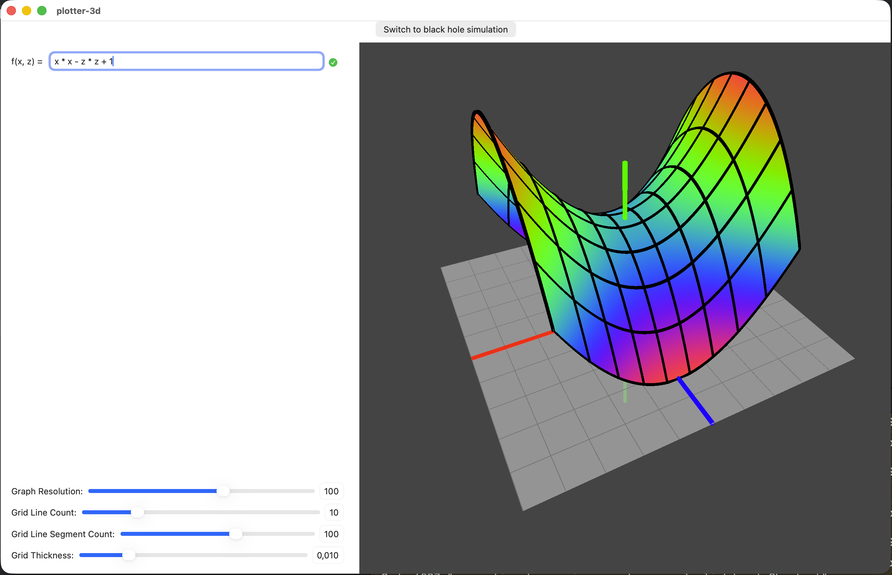
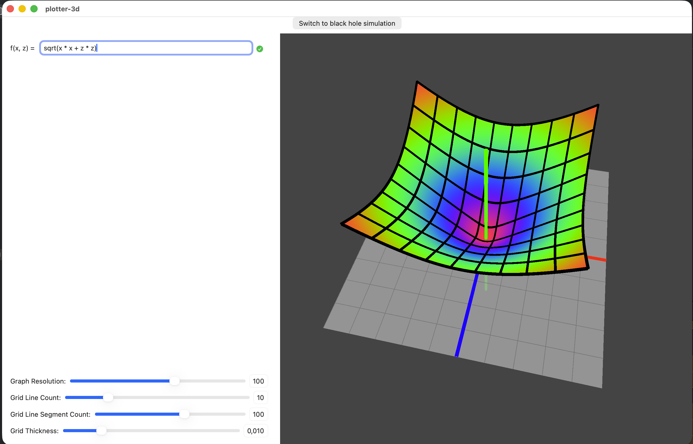
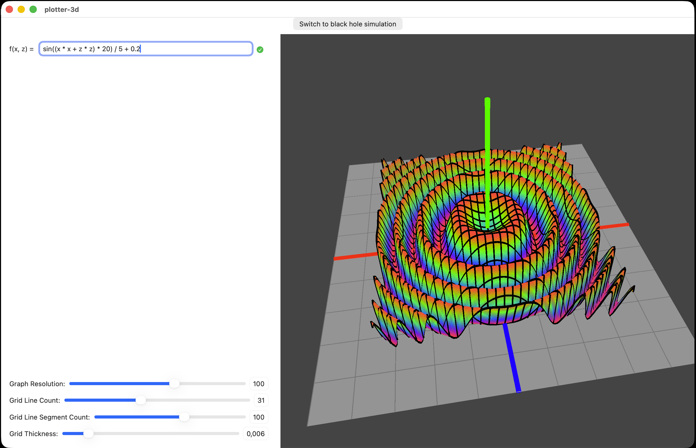
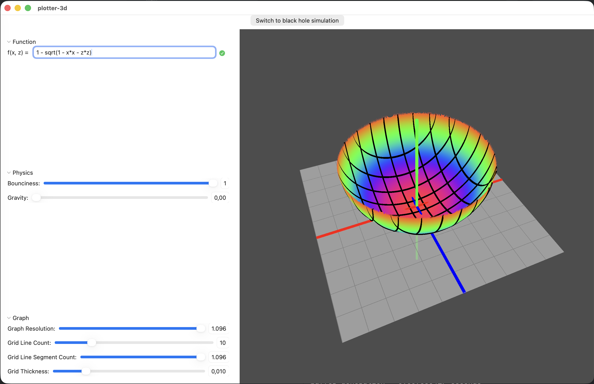

# Interactive 3D function plotter for MacOS

Written in Swift with the SwiftUI framework and with the Metal Graphics API.

## Features

- plot custom graphs, with many build in functions
    - available operators: + - \* /
    - available functions (trigonometric): sin, cos, tan, asin, acos, atan, atan2, sinh, cosh, tanh
    - available functions (exponential): pow, sqrt, exp, log, log2, log10
    - available functions (conditional): abs, min, max
- graph is colored by height smoothly, making it easier to orient yourself
- graph has a grid mesh, adjustable in resolution and thickness
- easy camera controls
    - zoom with mouse wheel
    - rotate graph by dragging mouse

## Gallery

